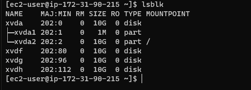
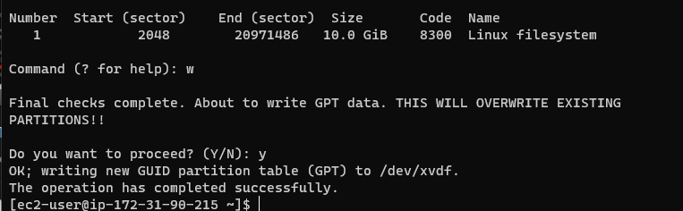
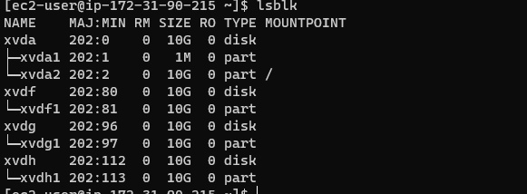
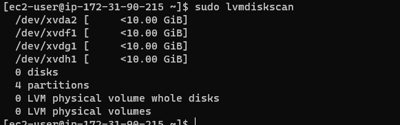
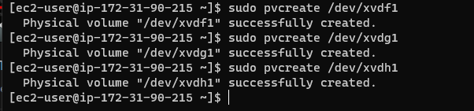
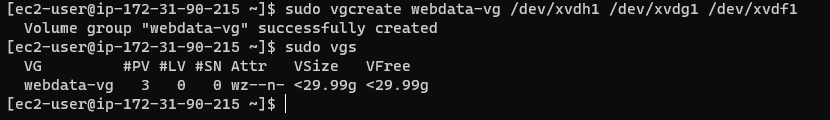
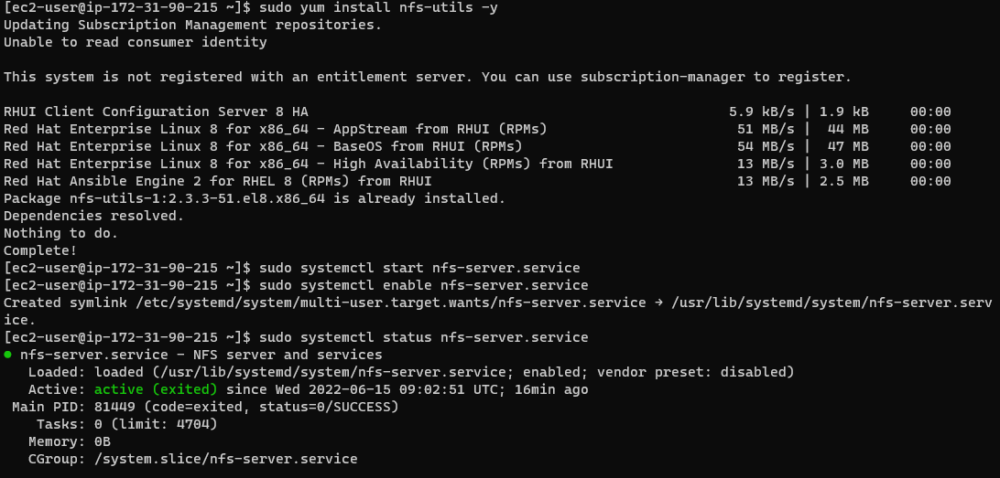
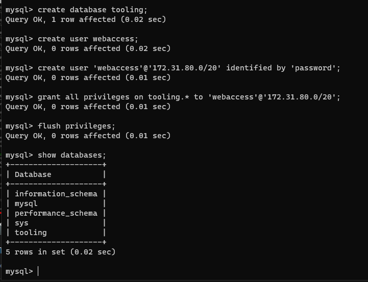
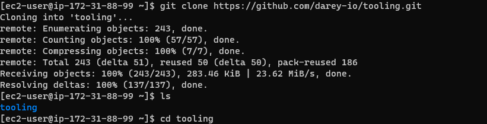
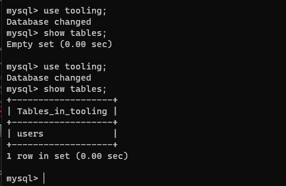

## DOCUMENTATION OF PROJECT 7

This is the documentation of project 7. In this project we will be doing the devops tooling website solution.

first we prepare an NFS server and attach three volumes to it. based on project 6 we configure LVM on NFS server.

Now we create mount points on /mnt directory for the logical volumes.

Now we have created and mounted our logical and physical volumes.

Install NFS server, configure it to start on reboot and make sure it is up and running.

use the following commands 

`sudo yum -y update
sudo yum install nfs-utils -y
sudo systemctl start nfs-server.service
sudo systemctl enable nfs-server.service
sudo systemctl status nfs-server.service`

Export the mounts for webservers’ subnet cidr to connect as clients. Make sure we set up permission that will allow our Web servers to read, write and execute files on NFS.
Use the following command.

`sudo chown -R nobody: /mnt/apps`

`sudo chown -R nobody: /mnt/logs`

`sudo chown -R nobody: /mnt/opt`

`sudo chmod -R 777 /mnt/apps`

`sudo chmod -R 777 /mnt/logs`

`sudo chmod -R 777 /mnt/opt`

`sudo systemctl restart nfs-server.service` .

Configure access to NFS for clients within the same subnet. open text editor with the command `sudo vi /etc/exports` input the following codes inside 

/`mnt/apps <Subnet-CIDR>(rw,sync,no_all_squash,no_root_squash)
/mnt/logs <Subnet-CIDR>(rw,sync,no_all_squash,no_root_squash)
/mnt/opt <Subnet-CIDR>(rw,sync,no_all_squash,no_root_squash)`

save and close the file.

Now check which port is used by NFS and open it using Security Groups uwing the command `rpcinfo -p | grep nfs`

in order for NFS server to be accessible from your client, you must also open following ports: TCP 111, UDP 111, UDP 2049.

Now we configure the database server.
Now 
install MySQL server
create a database and name it tooling
then create a database user and name it webaccess
Grant permission to webaccess user on tooling database.

Now we prepare the web servers. in the consequent steps we would be doing the following 
During the next steps we will do following:

Configure NFS client (this step must be done on all three servers).

Deploy a Tooling application to our Web Servers into a shared NFS folder.

Configure the Web Servers to work with a single MySQL database.

firstly
Install NFS client using the comamnd
`sudo yum install nfs-utils nfs4-acl-tools -y`

Mount /var/www/ and target the NFS server’s export for apps using the commands
`sudo mkdir /var/www`

`sudo mount -t nfs -o rw,nosuid<NFS-Server-Private-IP-Address>:/mnt/apps /var/www`

Verify that NFS was mounted successfully by running `df -h.`
now we use the text editor vi to configure the webservers using command `sudo vi /etc/fstab`

Add the line below

`<NFS-Server-Private-IP-Address>:/mnt/apps /var/www nfs defaults 0 0`

Now we install Remi’s repository, Apache and PHP.\
Using the commands below.

`sudo yum install httpd -y`

`sudo dnf install https://dl.fedoraproject.org/pub/epel/epel-release-latest-8.noarch.rpm`

`sudo dnf install dnf-utils http://rpms.remirepo.net/enterprise/remi-release-8.rpm`

`sudo dnf module reset php`

`sudo dnf module enable php:remi-7.4`

`sudo dnf install php php-opcache php-gd php-curl php-mysqlnd`

`sudo systemctl start php-fpm`

`sudo systemctl enable php-fpm`

`setsebool -P httpd_execmem 1`

Now locate the log folder for Apache on the Web Server and mount it to NFS server’s export for logs.

Now fork the tooling source code from Darey.io Github Account
 Install git on your web server 
 then clone the repo into your webserver.

 Deploy the tooling website’s code to the Webserver. Ensure that the html folder from the repository is deployed to /var/www/html.

 Update the website’s configuration to connect to the database (in /var/www/html/functions.php file).Apply tooling-db.sql script to our database server.
 
 

 

 Open the website in your browser and make sure you can login into the website with myuser user.

 

 We have just implemented a web solution for a DevOps team using LAMP stack with remote Database and NFS servers.

 # THIS IS THE END OF PROJECT 7
 

